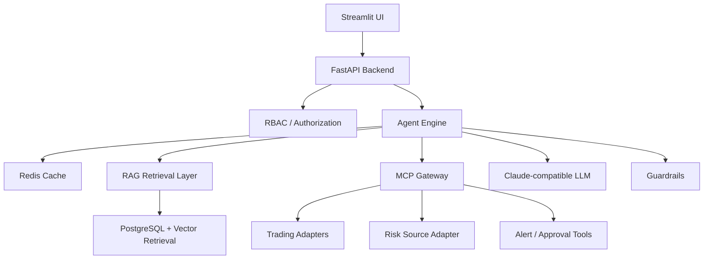

# Trading and Risk Agentic Platform

AI agentic crypto risk operations platform with an MCP gateway, Streamlit frontend, FastAPI backend, LLM orchestration, retrieval, cache, and local adapters for trading analytics and risk scoring.

## Overview

This repository is the project-owned application layer for a crypto risk copilot. It brings together:

- a Streamlit frontend
- a FastAPI backend
- a LangChain-based agent workflow with Claude-compatible models
- an MCP gateway for tool orchestration
- retrieval over internal knowledge and operating rules
- Redis-backed cache and short-term conversation context
- local adapters to upstream trade-analysis and risk-source assets
- project-owned operational data, alerts, approvals, and audit records

The detailed product requirements live in [docs/PROJECT_REQUIREMENTS.md](docs/PROJECT_REQUIREMENTS.md).

## What The Platform Does

The platform is designed for crypto trading risk operations workflows such as:

- investigating unusual account or wallet activity
- asking natural-language questions about suspicious trading behavior
- scoring accounts against local seeded risk profiles
- retrieving policy and operating knowledge with evidence
- creating alerts and review actions
- maintaining an audit trail for operator and agent activity

Representative prompts:

- `Which accounts became riskier in the last 24 hours?`
- `Why was this wallet flagged as suspicious?`
- `Show me top accounts by abnormal turnover and high risk scores.`
- `Run batch risk scoring for accounts with repeated failed withdrawals.`

## Architecture



## Upstream Sources

This project reuses upstream assets as one-way sources rather than as user-facing applications:

- trade analytics source: `crypto_trade_plot`
  vendored path: `integrations/sources/trade_source/vendor/crypto_trade_plot/`
- risk scoring source: `ml_risk_control`
  vendored path: `integrations/sources/risk_source/vendor/ml_risk_control/`

The integration approach favors local adapters over mandatory upstream APIs so the platform can run locally as a single project-owned application.

## Core Capabilities

- unified frontend owned by this repository
- RBAC-aware workflow entry and operator views
- four core MCP SDK tools for knowledge search, account risk scoring, trade metrics, and action recommendations
- retrieval-backed answers with supporting evidence
- local risk scoring from seeded risk-source profiles
- structured audit history for user actions and tool calls
- internal SQL migrations and seed data for platform-owned state

The current SDK MCP catalog is `knowledge.search`, `risk.score_account`,
`trade.query_metrics`, and `ops.create_alert_or_action`.

batch scoring and audit review are available through authenticated backend
workflows. The current MCP SDK surface is intentionally limited to the four
core tools listed above.

## Repository Layout

```text
mcp-gateway-agents/
├── backend/
├── data/
├── docs/
├── frontend/
├── integrations/
├── scripts/
├── sql/
└── tests/
```

## Key Directories

- `frontend/`: Streamlit entrypoint, pages, and UI helpers
- `backend/`: API app, agent, auth, guardrails, retrieval, services, storage, and MCP gateway modules
- `integrations/`: upstream trade and risk adapters plus canonical external-data contracts
- `sql/`: schema migrations and seed data
- `data/`: local fixtures, knowledge inputs, and seeded assets
- `docs/`: requirements and supporting architecture notes

## Local Run

The default local deployment runs the Streamlit frontend, FastAPI backend,
PostgreSQL/pgvector, and Redis through Docker Compose.

```bash
cp .env.example .env
docker compose up -d --build
```

Open `http://127.0.0.1:8501/` for the authenticated workspace. The backend
health endpoint is available at `http://127.0.0.1:8000/health`.

The demo workspace accounts use the password `demo-password`:

- `analyst_demo`
- `risk_operator_demo`
- `supervisor_demo`
- `admin_demo`

For host-process development, install the project with `uv sync --dev`, then
start the backend and frontend separately. The complete local operating and
verification reference is [docs/LOCAL_RUNBOOK.md](docs/LOCAL_RUNBOOK.md).

### Configuration

The default path uses the local embedding model and deterministic planner
fallbacks. An Anthropic API key is optional and is not required to run the
Compose stack.

## Repository Contents

The repository includes:

- a backend health endpoint at `GET /health`
- a project-owned authenticated Streamlit workspace
- integration boundaries for trade and risk source adapters
- SQL migrations for core schemas, identity tables, conversation tables, and audit tables

## Notes

- `texts/` is intentionally ignored and treated as scratch or raw ideation space.
- Upstream projects are not required to expose remote APIs for local development.
- This repository is intended to be the only primary frontend entry for the overall solution.
