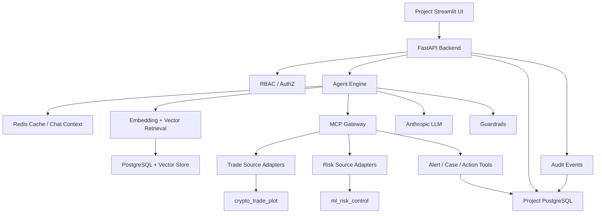

# MCP Gateway + Agentic Crypto Risk Platform Requirements

## 1. Document Purpose

This document defines the final target plan for the current project under `mcp-gateway-agents/`.

The project goal is to build, from scratch in the current directory, a demo-ready agentic application for crypto trading risk operations that combines:

- a unified project-owned frontend
- a FastAPI backend
- an agent engine powered by Anthropic models
- an MCP gateway for tool orchestration
- a local data platform with relational and vector retrieval support
- one-way capability and data reuse from the existing trade-analysis and risk-model projects

This document also defines staged delivery requirements so the development process can be executed with clear, testable milestones.

## 2. Background And Inputs

### 2.1 Existing reusable assets

The project may reuse the following assets as upstream sources only:

- Trade analysis source:
  `/Users/harryliu/Documents/workspace/DataAnalysisPrj/crypto_trade_plot`
- Risk control source:
  `/Users/harryliu/Documents/workspace/DataAnalysisPrj/ml_risk_control`
- Anthropic API Key:
  supplied externally at runtime

### 2.2 Mandatory constraints

- The frontend must be implemented inside this project and become the only user-facing entry.
- The existing trade-analysis and risk-control projects are not treated as user-facing frontends.
- Data and reusable capabilities flow one-way from those two projects into this project.
- Initial implementation should avoid requiring the upstream projects to expose remote APIs.
- Upstream reuse should happen through local adapters first, with service extraction optional later.

## 3. Product Vision

Build a crypto trading risk copilot that lets different internal roles:

- inspect market, account, order, and trade behavior
- ask natural-language questions about suspicious trading activity
- trigger risk scoring on accounts or cohorts
- retrieve policy, model, and case knowledge with evidence
- create and manage alerts, recommendations, and review actions
- keep a full audit trail of agent reasoning support data, tool calls, and operator actions

The end state is a closed loop:

1. user asks from the project-owned frontend
2. backend authenticates and authorizes the request
3. agent plans and invokes tools through the MCP gateway
4. system reads cache, database, knowledge base, and reusable upstream capabilities
5. guardrails review the answer and action proposal
6. response is rendered in frontend
7. alerts, actions, and audit records are persisted back into this project

## 4. Business Scenario

The demo scenario is crypto trading risk operations.

Representative prompts:

- "Which accounts became riskier in the last 24 hours?"
- "Why was this wallet flagged as suspicious?"
- "Show me top accounts by abnormal turnover and high model risk."
- "Run batch risk scoring for accounts with repeated failed withdrawals."
- "Create a level-2 review case for the highest-risk accounts."

## 5. Goals And Non-Goals

### 5.1 Goals

- Build a full-stack demo with a project-owned frontend and backend.
- Integrate trade analytics and risk scoring into one agent workflow.
- Implement MCP-based tool orchestration for trade, risk, knowledge, and ops actions.
- Provide RBAC, audit trail, cache, and knowledge retrieval.
- Persist enough mock operational data to support realistic end-to-end flows.
- Make each major development phase independently verifiable.

### 5.2 Non-goals

- No real-money execution or exchange connectivity in phase 1.
- No requirement to productionize upstream projects as remote services in the MVP.
- No full retraining pipeline redesign for the risk model.
- No multi-tenant SaaS hardening in the first delivery.
- No irreversible enforcement action automation without explicit approval logic.

## 6. Target Users And RBAC

### 6.1 Primary user types

- Risk analyst
- Risk operator
- Supervisor
- Platform administrator

### 6.2 RBAC roles

The system should define at least the following roles:

#### `viewer`

- can view dashboards, chat outputs, alert lists, case history, and reports
- cannot trigger scoring, create alerts, or approve actions

#### `analyst`

- inherits viewer permissions
- can query accounts, run analysis, trigger single or batch scoring, and draft findings
- cannot execute high-impact operational actions

#### `risk_operator`

- inherits analyst permissions
- can create alerts, update alert status, add case notes, and submit action recommendations
- cannot approve the highest-risk actions alone

#### `supervisor`

- inherits risk_operator permissions
- can approve or reject sensitive actions such as account freeze, restrictions, or case closure

#### `admin`

- full platform administration
- can manage users, roles, system settings, knowledge base administration, and audit review

### 6.3 Optional non-human role

#### `service_account`

- used for internal sync jobs, scheduled indexing, and backend-only service execution

## 7. System Scope

### 7.1 In scope

- Streamlit frontend in this repository
- FastAPI backend in this repository
- Anthropic-backed agent orchestration
- MCP gateway and tool registry
- PostgreSQL-backed application data model
- vector retrieval for policy and knowledge search
- Redis cache for response reuse and short-term conversation state
- local adapters to trade-analysis and risk-model source projects
- mock data generation and data seeding
- audit logging and operator action tracking

### 7.2 Out of scope for MVP

- real exchange order placement
- live market data subscriptions
- multi-region deployment
- external identity provider integration
- automatic model retraining and drift remediation loops

## 8. High-Level Architecture



## 9. Data Flow Principles

### 9.1 Frontend ownership

This project owns the only frontend used in the solution. Upstream Streamlit or HTML pages are treated as source material, not as the final primary interface.

### 9.2 One-way upstream flow

Upstream projects only feed this project through:

- source data
- local callable functions
- model artifacts
- diagnostics metadata
- report assets when useful

This project should not depend on upstream UI navigation to complete user flows.

### 9.3 Progressive decoupling

The integration path should be:

1. local adapter access
2. internal stable contracts
3. optional later API extraction if deployment needs justify it

## 10. Integration Strategy

### 10.1 API requirement decision

For the MVP:

- trade side does not need to expose an external API
- risk side does not need to expose an external API

The project should access them through internal adapters that wrap:

- file readers
- Python modules
- persisted artifacts
- report-generation helpers

### 10.2 Future service extraction trigger

Remote APIs for upstream components should only be introduced when at least one of the following becomes true:

- independent deployment is required
- scaling needs diverge
- permission boundaries require process isolation
- non-Python consumers need stable network access

## 11. Repository Structure Requirements

The repository should be restructured intentionally rather than using a flat `integrations` layout.

Recommended structure:

```text
mcp-gateway-agents/
├── docs/
├── frontend/
│   ├── app.py
│   ├── pages/
│   ├── components/
│   └── services/
├── backend/
│   ├── api/
│   ├── agent/
│   ├── mcp_gateway/
│   ├── auth/
│   ├── guardrails/
│   └── storage/
├── integrations/
│   ├── sources/
│   │   ├── trade_source/
│   │   └── risk_source/
│   ├── tools/
│   └── contracts/
├── data/
│   ├── seeds/
│   ├── fixtures/
│   └── knowledge/
├── sql/
│   ├── migrations/
│   └── seeds/
├── tests/
│   ├── unit/
│   ├── integration/
│   └── smoke/
├── scripts/
├── compose.yaml
└── README.md
```

### 11.1 Integration layer responsibilities

#### `integrations/sources`

- own upstream access logic
- normalize external data structures
- isolate file paths, artifact paths, and module import specifics

#### `integrations/tools`

- expose agent-usable tool functions
- translate business requests into source calls and DB writes

#### `integrations/contracts`

- define canonical models used inside this project
- prevent direct leakage of upstream schema complexity into the rest of the app

## 12. Functional Requirements

### 12.1 Frontend

The frontend must include:

- login or role-switch demo entry
- dashboard home
- natural-language agent chat interface
- account search and account detail view
- alerts and cases page
- scoring page for single account and cohort scoring
- report and evidence panel
- operation history / audit viewer for privileged users

### 12.2 Backend API

The backend must include:

- health endpoint
- auth/session endpoints or demo auth bootstrap
- chat request endpoint
- account search endpoint
- risk score trigger endpoints
- alerts and case management endpoints
- audit query endpoint
- knowledge indexing and retrieval endpoints for admin workflows

### 12.3 Agent engine

The agent must support:

- role-aware tool selection
- conversation memory
- retrieval-augmented answers
- structured tool calling
- evidence-backed recommendations
- refusal or downgrade behavior when user lacks permissions

### 12.4 MCP gateway

The MCP layer must expose at least these tool groups:

- trade metrics and anomaly query tools
- risk scoring tools
- knowledge retrieval tools
- alert and case operation tools
- audit lookup tools

### 12.5 Guardrails

Guardrails must cover:

- role-based action blocking
- missing-evidence warning on sensitive conclusions
- unsafe action review requirement
- output sanity checks for unsupported claims
- prompt injection resistance in retrieved knowledge inputs

## 13. Data Model Requirements

The project should add and seed enough database structures to support a realistic demo.

### 13.1 Identity and access tables

- `users`
- `roles`
- `user_role_bindings`
- `service_accounts`
- `api_tokens`

### 13.2 Conversation and audit tables

- `chat_sessions`
- `chat_messages`
- `tool_call_logs`
- `audit_events`

### 13.3 Trading domain tables

- `accounts`
- `wallets`
- `orders`
- `trades`
- `positions`
- `price_ticks`

### 13.4 Risk and operations tables

- `risk_feature_snapshots`
- `risk_scores`
- `risk_alerts`
- `case_records`
- `case_actions`
- `review_decisions`

### 13.5 Knowledge and retrieval tables

- `knowledge_documents`
- `knowledge_chunks`
- `knowledge_embeddings`

## 14. Mock Data Requirements

The project must generate or seed the following data categories:

### 14.1 Trading activity data

- accounts and wallets
- crypto orders and trades
- asset prices over time
- abnormal trade bursts
- suspicious transfer-like patterns

### 14.2 Risk feature and score data

- risk-relevant account attributes
- model-ready feature snapshots
- historical risk scores
- labeled high-risk and low-risk example accounts

### 14.3 Knowledge base data

- risk rules and policy summaries
- model card excerpts and threshold guidance
- historical incident examples
- case handling SOP documents

### 14.4 Demo users

- at least one seeded user for each RBAC role

## 15. Upstream Reuse Requirements

### 15.1 Trade analysis reuse

The project should reuse and adapt:

- mock data patterns from `crypto_trade_plot`
- existing transaction analysis logic where practical
- Plotly chart generation patterns

Expected project-owned behavior:

- ingest or transform upstream-like trading data into current project tables
- expose metrics and summaries via tools and frontend panels
- optionally embed or reproduce Plotly visual output inside this project

### 15.2 Risk control reuse

The project should reuse and adapt:

- persisted XGBoost artifacts
- local inference service concepts
- diagnostic metadata and model reporting outputs

Expected project-owned behavior:

- load model artifacts from the upstream risk project
- run single-account and batch scoring inside this project
- store resulting scores and explanations in current project tables

## 16. Non-Functional Requirements

### 16.1 Maintainability

- modular project structure
- clear contracts between frontend, backend, integrations, and tools
- environment-driven configuration
- repeatable local setup

### 16.2 Observability

- structured application logs
- tool invocation logs
- audit event persistence
- error surfaces suitable for UI display and debugging

### 16.3 Security

- role-based authorization
- secret configuration through environment variables only
- no hard-coded API keys
- action approval boundaries for high-risk operations

### 16.4 Testability

- unit coverage for adapters, tools, RBAC checks, and scoring wrappers
- integration coverage for API to agent to tool paths
- smoke coverage for frontend startup and seeded scenario flows

## 17. Suggested MCP Tool Contract Surface

Minimum tool inventory:

### `trade.query_metrics`

- returns aggregated trade metrics for a time window, account, asset, or anomaly slice

### `trade.query_account_activity`

- returns detailed account activity summary and suspicious signals

### `trade.render_dashboard_payload`

- returns frontend-ready chart data or references for visualization

### `risk.score_account`

- runs model scoring for one account and returns probability, band, threshold decision, and explanation summary

### `risk.batch_score_accounts`

- scores a list or query-defined cohort of accounts and persists results

### `knowledge.search`

- returns top matching policy, model, and case knowledge chunks with citations

### `ops.create_alert`

- creates a risk alert tied to an account, reason, and evidence set

### `ops.submit_case_action`

- records proposed actions such as review, limit, or freeze request

### `audit.fetch_recent_events`

- returns recent operator and tool execution history

## 18. Phased Delivery Plan

Development must be divided into large stages with verifiable outputs.

### Phase 1. Foundation And Project Skeleton

#### Objectives

- establish repo structure
- define config and environment model
- create base frontend and backend entrypoints
- create initial SQL migration layout
- define integration contracts

#### Required deliverables

- structured directory skeleton
- project README with startup instructions
- environment template file
- first migration files for core schemas
- placeholder frontend and backend apps booting successfully

#### Verification criteria

- repository tree matches planned structure
- backend health endpoint responds successfully
- frontend home page renders successfully
- migrations can be applied locally

### Phase 2. Data Platform And Seeded Domain Model

#### Objectives

- implement PostgreSQL schema
- seed RBAC users and trading domain data
- seed knowledge documents
- implement data access layer

#### Required deliverables

- executable migrations
- seed scripts
- populated local demo database
- sample datasets and seed logs

#### Verification criteria

- all required tables exist
- seeded users and roles are queryable
- seeded accounts, trades, scores, and knowledge docs are queryable
- repeatable reset-and-seed workflow succeeds

### Phase 3. Upstream Adapters And Internal Contracts

#### Objectives

- connect the trade-analysis source through local adapters
- connect the risk-model source through artifact-backed adapters
- normalize upstream outputs into internal contracts

#### Required deliverables

- `integrations/sources/trade_source/*`
- `integrations/sources/risk_source/*`
- canonical contract models
- adapter unit tests

#### Verification criteria

- trade adapter can load and transform source data into current project shape
- risk adapter can load the model artifact and produce a valid score
- upstream path details stay isolated to the adapter layer

### Phase 4. Backend Services, RBAC, And API Surface

#### Objectives

- implement auth demo flow and RBAC middleware
- expose domain APIs
- persist chat, alerts, and audit events

#### Required deliverables

- auth or demo role-switch implementation
- API endpoints for chat, accounts, scores, alerts, and audit queries
- RBAC enforcement layer
- API integration tests

#### Verification criteria

- different roles see different allowed behaviors
- unauthorized actions are blocked with clear responses
- core API routes pass integration tests

### Phase 5. MCP Gateway And Tooling Layer

#### Objectives

- define MCP tool registry
- expose trade, risk, knowledge, ops, and audit tools
- ensure tools are structured and testable independently

#### Required deliverables

- MCP gateway module
- initial tool implementations
- tool contract tests

#### Verification criteria

- each required tool can be invoked successfully
- tool outputs follow stable schemas
- tool logs are persisted or emitted in a structured way

### Phase 6. Agent, RAG, Cache, And Guardrails

#### Objectives

- wire Anthropic model into agent engine
- add Redis-backed short-term memory and cache
- add document chunking, embedding, and retrieval flow
- add guardrails around sensitive outputs

#### Required deliverables

- working agent orchestration flow
- RAG ingestion and retrieval pipeline
- cache integration
- guardrail validators and tests

#### Verification criteria

- repeated similar prompt can hit cache when appropriate
- knowledge-backed prompt returns citations
- restricted action prompt is downgraded or blocked based on role
- unsupported confident claims are reduced by evidence checks

### Phase 7. Frontend Experience And Closed-Loop Workflow

#### Objectives

- build the main user workflow in Streamlit
- connect chat, dashboard, scoring, and alert pages
- render project-owned charts and evidence panels

#### Required deliverables

- multipage frontend
- account view and alert workflow
- chat UI with citations and action outputs
- dashboard visualizations based on project data

#### Verification criteria

- analyst can complete an end-to-end investigation flow from UI
- operator can create an alert and submit a case action from UI
- supervisor can approve or reject a sensitive action from UI

### Phase 8. End-To-End Validation, Packaging, And Documentation

#### Objectives

- run end-to-end smoke tests
- add Docker Compose packaging
- finalize runbook and architecture docs

#### Required deliverables

- compose stack for app services
- smoke test scripts
- final architecture and runbook documentation

#### Verification criteria

- compose stack boots required services
- seeded demo scenario runs end-to-end
- documentation is sufficient for a fresh local setup

## 19. Definition Of Done

The MVP is considered complete when all of the following are true:

- project-owned frontend is the main working user entry
- backend, agent, MCP tools, data store, and audit trail are connected
- upstream trade and risk capabilities are reused through stable local adapters
- at least one realistic analyst-to-operator-to-supervisor flow is demonstrable
- all major phases have concrete deliverables and verification evidence
- the repository contains enough documentation for another developer to run and inspect the system locally

## 20. Recommended Immediate Next Steps

1. Create the repository skeleton and configuration files.
2. Define the SQL migrations for RBAC, chat, trading, risk, and knowledge tables.
3. Implement source adapters before building the full agent layer.
4. Stand up FastAPI and Streamlit early so later work can be integrated continuously.
5. Add the first end-to-end demo flow as soon as the adapters and RBAC are available.
